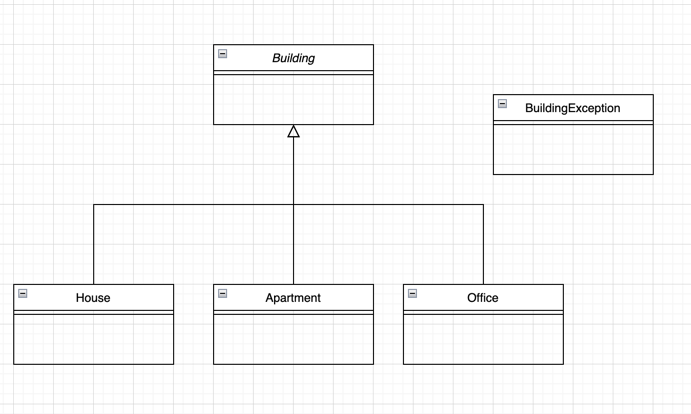

# Java classes

You must write a hierarchy of classes to describe three different kinds of rental property. The following UML diagram shows the classes you must write:

For every house, your program must record the number of bedrooms and number of bathrooms in the house. For every apartment and office building, your program must record the number of units in the building, plus whether or not the building has an elevator. For apartment buildings only, you must also record a "location rating" -- an integer from 1 to 5 that rates the quality of the neighbourhood. For example, a quiet neighborhood with good shopping and public transportation might rate a 5, while a run-down neighborhood with no bus service might rate a 1. 

## Constructors

The House class must have a constructor which takes (in order) the number of bedrooms and the number of bathrooms in the house.
The Apartment class must have a constructor which takes (in order) the number of units in the building, the location rating, and a boolean telling you whether the unit has an elevator.
The Office class must have a constructor which takes (in order) the number of units in the building and a boolean telling you whether the unit has an elevator. 

## Methods

`toString`: The House, Apartment and Office classes must have `toString` methods. Make sure that each toString includes the values of all the instance variables.

`extension`: There must be an extension method for building an extension onto each kind of building. For houses, the extension method takes two parameters: how many bedrooms and bathrooms are in the new part of the house. For apartments and offices, the extension method takes only one parameter: how many new units are being added.

`addElevator`: There must be an `addElevator()` method for adding an elevator to an apartment or office building. Houses can't have elevators. A building can only have one elevator.

`rent`: The House, Apartment and Office classes must have rent methods. These methods must have no parameters and must return the amount of rent the landlord may charge for the building each month. The rent will always be an integer. There is a different rent formula for each type of building:

 - Houses: The rent for a house is $1000 plus $200 for each bedroom after the second one and $100 for each bathroom after the first one. For example, a house with two bedrooms and one bathroom is just $1000, while a house with three bedrooms and two bathrooms would rent for $1300.
- Apartments: The basic rent for each apartment in an apartment building is $500. If the building's location rating is greater than 1 (the minimum), the rent increases by $100 for each location rating. Finally, if the building has an elevator, the rent increases by $50. For example, an apartment in a building with an elevator and a location rating of 3 would rent for $500 + $200 + $50 = $750. If that building contains 10 apartments, the total rent is $7500.
- Offices: The rent for each office in an office building is $2000, plus an extra $50 if the building has an elevator. For example, if an office building with an elevator the rent for each office is $2050. If there are 10 offices in the building, the total rent for the building is $20,500. 

`tax`: The House, Apartment and Office classes must have tax methods. These methods must have no parameters and must return the amount of property tax the landlord must pay per month. The tax will always be an integer. There is a different tax formula for each type of building:

- Houses: For a house, the tax is $200 per bedroom and $50 per bathroom. For example, a house with 3 bedrooms and 2 bathrooms would be taxed $700.
- Apartments: An apartment building is taxed at the rate of $200 per unit, plus an extra $100 if the building has an elevator. The location rating does not affect the tax rate. For example, a building with 10 apartments and an elevator would be taxed $2100 per month.
- Office taxed $1000 plus an extra $1000 for each office more than 5. There is an extra $100 tax if the building has an elevator. For example, an office building with 10 units and an elevator would be taxed $6100. An office building with 5 units and no elevator would be taxed $1000. 